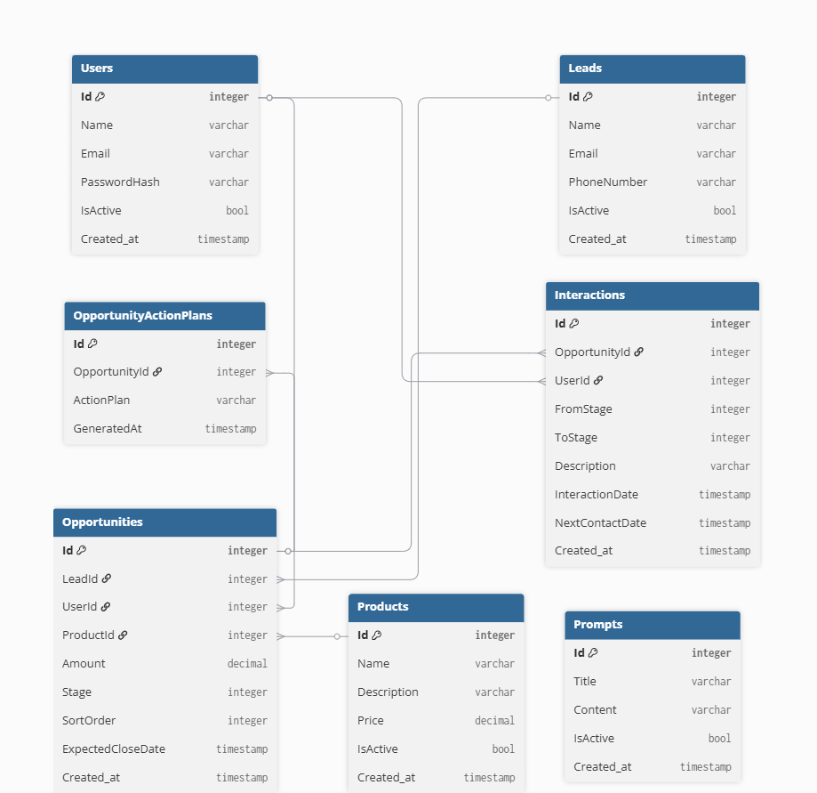

# Leadfy - Documentação do Projeto

## Introdução

### Descrição Geral do Projeto

O Leadfy é um CRM de vendas criado para ajudar no gerenciamento de leads e oportunidades comerciais. O sistema foi desenvolvido com o objetivo de organizar o processo comercial, acompanhar o funil de vendas e facilitar o controle das informações da equipe.

Atualmente, o projeto também possui funcionalidades de IA para geração de planos de ação relacionados às oportunidades cadastradas.

### Objetivos

* Gerenciar leads e oportunidades comerciais;
* Organizar o pipeline de vendas em formato Kanban;
* Registrar interações durante o processo comercial;
* Centralizar as informações do funil de vendas;
* Melhorar a produtividade da equipe comercial;
* Auxiliar na análise comercial com configurações de prompts e geração de planos de ação usando IA.

### Escopo

O sistema cobre funcionalidades ligadas ao gerenciamento comercial, incluindo cadastro de usuários, leads, produtos, oportunidades e acompanhamento das etapas do funil de vendas.

Nesta versão do projeto, não fazem parte do escopo funcionalidades como integrações externas, automações mais avançadas, dashboards analíticos completos, gestão pós venda ou gestão financeira aprofundada.

---

## Visão Geral do Sistema

### Arquitetura do Sistema

O Leadfy utiliza arquitetura em camadas para deixar o projeto mais organizado, facilitar a manutenção do código e separar melhor as responsabilidades de cada parte do sistema.

* **Frontend:** aplicação React com autenticação usando Context API, roteamento com `react-router-dom` e comunicação com a API através do Axios.
* **Backend:** API REST desenvolvida em ASP.NET Core 6, separada nos projetos `Api`, `Application`, `Domain`, `Repository` e `Service`.
* **Banco de Dados:** SQL Server.
* **ORM:** Entity Framework Core 6 e Dapper.

### Funcionalidades

As principais funcionalidades disponíveis no sistema são:

* Autenticação com JWT;
* Cadastro e gerenciamento de usuários;
* Cadastro de leads;
* Cadastro de produtos;
* Gerenciamento de oportunidades;
* Pipeline comercial em formato Kanban;
* Registro e consulta de interações por oportunidade;
* Configuração de prompts para IA;
* Geração de plano de ação com IA para oportunidades.

---

## Configuração do Ambiente

### Requisitos de Software e Hardware

Software necessário:

* Node.js e npm;
* .NET SDK 6;
* SQL Server;
* Git.

Hardware recomendado:

* Processador dual core ou superior;
* 8 GB de memória RAM ou mais;
* Espaço livre em disco para instalação e execução do projeto.

### Instruções de Instalação

#### 1. Instalar dependências do frontend

```bash
cd crm-app
npm install
```

#### 2. Restaurar dependências do backend

```bash
cd ../backend
dotnet restore crm.sln
```

#### 3. Aplicar migrações do banco

```bash
dotnet ef database update --project Repository --startup-project Api
```

#### 4. Executar o backend

```bash
cd Api
dotnet run
```

#### 5. Executar o frontend

Em outro terminal:

```bash
cd crm-app
npm start
```

### Configuração do Ambiente de Desenvolvimento

Backend:

* Configurar a string de conexão em `backend/Api/appsettings.json`;
* Configurar os dados de autenticação JWT no arquivo `appsettings.json`;
* Configurar os dados do token e modelo do GitHub Models.
* Ajustar as origens permitidas em `CorsOrigins`, se necessário.

Frontend:

* O cliente HTTP está configurado para consumir a API em `https://localhost:7287/api`;
* O frontend roda por padrão em `http://localhost:3000`.

URLs de desenvolvimento do backend:

* `https://localhost:7287`
* `http://localhost:5231`

### Dependências

Principais dependências do frontend (`crm-app`):

* React 19;
* React Router DOM 7;
* Axios;
* Bootstrap;
* React Bootstrap;
* React Icons;
* React Toastify;
* `@hello-pangea/dnd`.

Principais dependências e tecnologias do backend (`backend`):

* ASP.NET Core Web API;
* Entity Framework Core 6;
* SQL Server;
* JWT Bearer Authentication;
* Swagger / Swashbuckle;
* Dapper.

---

## Desenvolvimento

### Estrutura do Projeto

Estrutura utilizada nesta documentação:

```txt
Crm-Vendas/
|- crm-app/
|  |- public/
|  |- src/
|     |- components/
|     |- context/
|     |- pages/
|     |- routes/
|     |- services/
|     |- utils/
|- backend/
|  |- crm.sln
|  |- Api/
|  |- Application/
|  |- Domain/
|  |- Repository/
|  |- Service/
```

### Descrição das Camadas

* **Apresentação:** composta pelo frontend (`crm-app`) e pelo projeto `Api`, responsáveis pela interface do usuário, controllers HTTP, autenticação, Swagger e fluxo das requisições.
* **Domínio:** localizado no projeto `Domain`, onde ficam as entidades, enums e regras principais do negócio.
* **Repositório:** implementado no projeto `Repository`, responsável pelo contexto do banco, mapeamentos, migrations e acesso aos dados.
* **Serviços:** localizado no projeto `Service`, contendo serviços auxiliares utilizados pela aplicação.

Além dessas camadas, o projeto `Application` é responsável pelos casos de uso, validações e DTOs usados pela API.

---

## API

### Documentação da API

A API REST do Leadfy possui documentação automática gerada pelo Swagger.

A documentação contém:

* Endpoints disponíveis;
* Métodos HTTP;
* Parâmetros de entrada;
* Modelos de requisição;
* Modelos de resposta;
* Códigos de status HTTP.

---

## Interface do Usuário

### Descrição das Funcionalidades da Interface

A interface do Leadfy possui as seguintes telas e funcionalidades:

* Tela de login;
* Tela de registro para novo usuário;
* Listagem e gerenciamento de leads;
* Listagem e gerenciamento de usuários;
* Listagem e gerencimaneto de produtos;
* Configuração de prompts;
* Kanban Board para acompanhamento das oportunidades, adicionar interações e gerar planos de ação.

---

## Banco de Dados

### Diagrama de Entidade-Relacionamento (ERD)

O banco de dados do Leadfy foi estruturado para armazenar as informações relacionadas aos usuários, leads, oportunidades e ao fluxo comercial.

Principais tabelas do sistema:

* `Users`;
* `Leads`;
* `Products`;
* `Opportunities`;
* `OpportunityActionPlans`;
* `Interactions`;
* `Prompts`.



---

## Considerações Finais

### Lições Aprendidas

Durante o desenvolvimento do Leadfy foram trabalhados conceitos como:

* Arquitetura em camadas;
* Arquitetura do frontend;
* Desenvolvimento Full Stack;
* Modelagem de banco de dados;
* APIs REST;
* Componentização com React;
* Autenticação e autorização;
* Integração com IA.

### Melhores Práticas

Algumas práticas adotadas durante o desenvolvimento:

* Clean Architecture;
* Separação de responsabilidades;
* Padronização de código;
* Utilização de DTOs;
* Versionamento com Git;
* Documentação com Swagger.

### Próximos Passos

Possíveis melhorias futuras para o projeto:

* Integração com APIs externas;
* Relatórios mais completos;
* Dashboard analítico mais completo;
* Automação comercial;
* Exportação de dados.
* Kanban com etapas dinâmicas;
* Gestão de pós-venda;
* Separação de dados por cliente.

---

## Anexos

### Referências e Recursos Adicionais

* Documentação React;
* Documentação ASP.NET Core;
* Documentação Entity Framework Core;
* Documentação SQL Server;
* Documentação GitHub.

### Links Úteis

* https://react.dev
* https://learn.microsoft.com/aspnet/core
* https://learn.microsoft.com/ef/core
* https://swagger.io
* https://docs.github.com/pt/rest/models/inference?apiVersion=2026-03-10&utm_source=chatgpt.com

### Créditos e Agradecimentos

Este projeto foi desenvolvido por **Rafaela de Oliveira Alves** como requisito para conclusão do curso de **Desenvolvedor Full Stack** da **Itera360**.

Agradeço à equipe da **Itera360**, especialmente aos monitores Alysson e João Victor Holanda, pelo apoio durante o curso e pelo suporte ao longo do desenvolvimento do projeto. Também agradeço aos colegas de turma pela troca de experiências, colaboração e incentivo.

```
```
